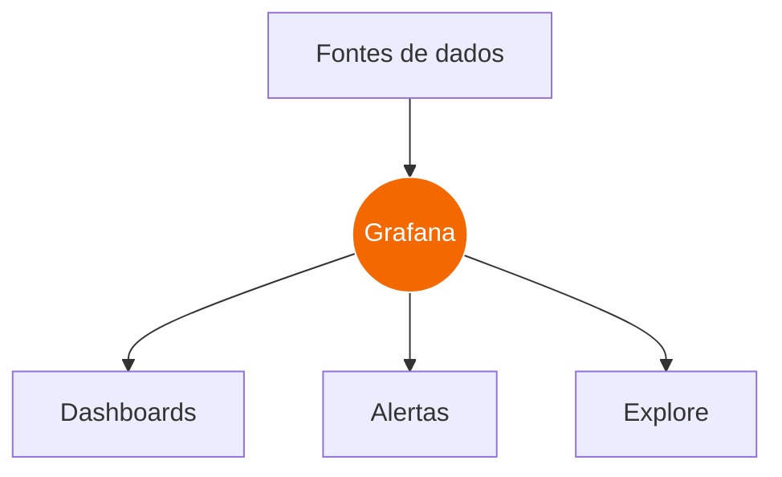
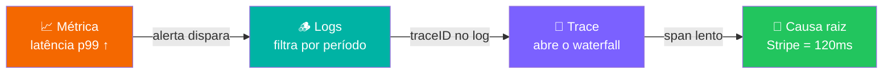

# Observabilidade com Grafana

Métricas · Logs · Traces — a stack **LGTM**

<div class="mt-8 flex justify-center gap-3 text-4xl opacity-90">
  <span class="i-logos-grafana" title="Grafana" />
  <span class="i-logos-prometheus" title="Prometheus" />
  <span class="i-logos-loki" title="Loki" />
</div>

<div @click="$slidev.nav.next" class="mt-12 py-1 cursor-pointer" hover:bg="white op-10">
  Pressione <kbd>Espaço</kbd> para avançar <carbon:arrow-right class="inline" />
</div>

<!--
Apresentação sobre observabilidade usando o ecossistema Grafana.
Objetivo: entender o que é, a composição (Prometheus/Loki/Tempo) e como os três pilares se conectam.
-->

---
transition: fade-out
layout: default
---

# Agenda

<div class="grid grid-cols-2 gap-x-10 gap-y-3 mt-6 text-lg">

<div v-click class="flex items-center gap-3"><span class="i-carbon-magnify text-orange-400" /> O que é observabilidade?</div>
<div v-click class="flex items-center gap-3"><span class="i-carbon-dashboard text-orange-400" /> O que é o Grafana?</div>
<div v-click class="flex items-center gap-3"><span class="i-carbon-layers text-orange-400" /> A stack LGTM</div>
<div v-click class="flex items-center gap-3"><span class="i-carbon-chart-line text-orange-400" /> Prometheus — métricas</div>
<div v-click class="flex items-center gap-3"><span class="i-carbon-catalog text-orange-400" /> Loki — logs</div>
<div v-click class="flex items-center gap-3"><span class="i-carbon-flow text-orange-400" /> Tempo — traces</div>
<div v-click class="flex items-center gap-3"><span class="i-carbon-connect text-orange-400" /> Correlação entre os 3 pilares</div>
<div v-click class="flex items-center gap-3"><span class="i-carbon-bullhorn text-orange-400" /> Dashboards & Alertas</div>

</div>

---
layout: center
class: text-center
---

# O que é Observabilidade?

<div class="text-xl opacity-80 mb-10">
A capacidade de <span v-mark.orange="1">entender o estado interno</span> de um sistema apenas observando suas <span v-mark.underline.cyan="2">saídas externas</span>.
</div>

<div class="grid grid-cols-3 gap-6 mt-4">
  <div v-click class="rounded-xl border border-orange-400/40 bg-orange-400/5 p-6">
    <div class="i-carbon-chart-line text-5xl text-orange-400 mx-auto mb-3" />
    <div class="text-2xl font-bold">Métricas</div>
    <div class="text-sm opacity-70 mt-2">O que está acontecendo? <br/>Números agregados ao longo do tempo.</div>
  </div>
  <div v-click class="rounded-xl border border-teal-400/40 bg-teal-400/5 p-6">
    <div class="i-carbon-catalog text-5xl text-teal-400 mx-auto mb-3" />
    <div class="text-2xl font-bold">Logs</div>
    <div class="text-sm opacity-70 mt-2">Por que aconteceu? <br/>Registros de eventos discretos.</div>
  </div>
  <div v-click class="rounded-xl border border-purple-400/40 bg-purple-400/5 p-6">
    <div class="i-carbon-flow text-5xl text-purple-400 mx-auto mb-3" />
    <div class="text-2xl font-bold">Traces</div>
    <div class="text-sm opacity-70 mt-2">Onde aconteceu? <br/>O caminho de uma requisição.</div>
  </div>
</div>

<div v-click class="mt-8 text-sm opacity-60">
Os <b>três pilares</b> da observabilidade — juntos contam a história completa.
</div>

---
layout: two-cols
layoutClass: gap-12
---

# O que é o Grafana?

<div class="mt-4 space-y-4 text-[15px]">

<v-clicks>

- 🎨 **Plataforma open-source** de visualização e análise de dados operacionais.

- 🔌 **Agnóstico de fonte de dados** — conecta em Prometheus, Loki, Tempo, Elastic, SQL, CloudWatch, e +150 datasources.

- 📊 **Dashboards** ricos e interativos — uma única tela de vidro ("single pane of glass").

- 🚨 **Alertas** unificados sobre qualquer fonte de dados.

- 🧩 **A empresa Grafana Labs** mantém uma stack completa: a **LGTM**.

</v-clicks>

</div>

::right::

<div class="mt-16 rounded-xl border border-gray-500/30 bg-black/20 p-4">



<div class="text-center text-xs opacity-60 mt-2">
Grafana = a camada de <b>consulta e visualização</b>.<br/>
Os dados vivem nos backends.
</div>

</div>

---
layout: center
---

# A Stack LGTM

<div class="text-center opacity-70 mb-8 -mt-4">O ecossistema completo da Grafana Labs</div>

<div class="grid grid-cols-4 gap-5">
  <div v-click class="rounded-xl border-2 border-teal-400/50 bg-teal-400/5 p-5 text-center">
    <div class="text-4xl font-black text-teal-400">L</div>
    <div class="text-xl font-bold mt-1">Loki</div>
    <div class="text-xs opacity-70 mt-2">Agregação de <b>logs</b>. "Prometheus para logs".</div>
  </div>
  <div v-click class="rounded-xl border-2 border-orange-400/50 bg-orange-400/5 p-5 text-center">
    <div class="text-4xl font-black text-orange-400">G</div>
    <div class="text-xl font-bold mt-1">Grafana</div>
    <div class="text-xs opacity-70 mt-2">Visualização e <b>dashboards</b>.</div>
  </div>
  <div v-click class="rounded-xl border-2 border-purple-400/50 bg-purple-400/5 p-5 text-center">
    <div class="text-4xl font-black text-purple-400">T</div>
    <div class="text-xl font-bold mt-1">Tempo</div>
    <div class="text-xs opacity-70 mt-2">Backend de <b>tracing</b> distribuído.</div>
  </div>
  <div v-click class="rounded-xl border-2 border-blue-400/50 bg-blue-400/5 p-5 text-center">
    <div class="text-4xl font-black text-blue-400">M</div>
    <div class="text-xl font-bold mt-1">Mimir</div>
    <div class="text-xs opacity-70 mt-2"><b>Métricas</b> em escala (compatível com Prometheus).</div>
  </div>
</div>

<div v-click class="mt-8 text-center text-sm opacity-70">
Na prática, muitos times usam <b class="text-orange-400">Prometheus</b> diretamente para métricas — Mimir é a versão escalável e multi-tenant.
</div>

---
layout: default
---

# Como os dados fluem

<div class="text-sm opacity-70 mb-2">Da aplicação instrumentada até a tela do Grafana</div>

<DataFlow class="mt-2" />

<div class="grid grid-cols-3 gap-4 mt-2 text-xs">
  <div v-click class="text-center"><b class="text-orange-400">Métricas</b> → Prometheus armazena séries temporais e responde via <b>PromQL</b>.</div>
  <div v-click class="text-center"><b class="text-teal-400">Logs</b> → Loki indexa só os <i>labels</i> e guarda o conteúdo comprimido, consultado via <b>LogQL</b>.</div>
  <div v-click class="text-center"><b class="text-purple-400">Traces</b> → Tempo recebe spans via OTLP e os relaciona por <b>traceID</b>.</div>
</div>

---
layout: section
---

# 📈 Prometheus
### Métricas — séries temporais

---

# Prometheus — o pilar das métricas

<div class="grid grid-cols-2 gap-8">
<div>

<v-clicks>

- 🕐 Banco de dados de **séries temporais** (TSDB).
- 🔄 Modelo **pull**: o Prometheus *raspa* (`scrape`) endpoints `/metrics`.
- 🏷️ Cada série = nome da métrica + **labels** (dimensões).
- 🔢 4 tipos: **Counter**, **Gauge**, **Histogram**, **Summary**.
- 🧮 Linguagem de consulta poderosa: **PromQL**.

</v-clicks>

<div v-click class="mt-4 rounded-lg bg-black/30 p-3 font-mono text-xs">
http_requests_total<span class="opacity-50">{</span><span class="text-orange-400">method</span>="GET", <span class="text-orange-400">status</span>="200"<span class="opacity-50">}</span> <span class="text-teal-400">1849</span>
</div>

</div>
<div>

<MetricChart label="rate(http_requests_total[1m])" unit="req/s" color="#f46800" />

<div v-click class="mt-4">

```sql
# Taxa de erro 5xx nos últimos 5 minutos
sum(rate(http_requests_total{status=~"5.."}[5m]))
  /
sum(rate(http_requests_total[5m]))
```

</div>

</div>
</div>

---

# Métricas em ação

<div class="text-sm opacity-70 mb-4">Séries temporais atualizando em tempo real — é isso que um painel do Grafana mostra.</div>

<div class="grid grid-cols-2 gap-5">
  <MetricChart label="rate(http_requests_total[1m])" unit="req/s" color="#f46800" :volatility="0.15" />
  <MetricChart label="node_cpu_seconds (utilização)" unit="%" color="#00b3a4" :volatility="0.1" />
  <MetricChart label="histogram_quantile(0.99, latency)" unit="ms" color="#7b61ff" :volatility="0.25" />
  <MetricChart label="go_memstats_heap_inuse_bytes" unit="MB" color="#3b82f6" :volatility="0.08" />
</div>

<div v-click class="mt-3 text-center text-xs opacity-60">
Quatro métricas, quatro perguntas: <b>tráfego</b>, <b>saturação</b>, <b>latência</b> e <b>uso de recursos</b> — os "RED" e "USE".
</div>

---
layout: section
---

# 🪵 Loki
### Logs — agregação eficiente

---

# Loki — o pilar dos logs

<div class="grid grid-cols-2 gap-8">
<div>

<v-clicks>

- 📦 Inspirado no Prometheus: **indexa apenas labels**, não o conteúdo.
- 💰 Muito mais **barato** que indexar texto completo (ex.: Elastic).
- 🏷️ Mesmo modelo de labels: `{job="checkout-api", level="error"}`.
- 🔍 Consulta com **LogQL** — filtros + extração + agregação.
- 🔗 Logs carregam o **traceID** → ponte direta para o Tempo.

</v-clicks>

<div v-click class="mt-4">

```sql
{job="checkout-api"}
  | logfmt
  | level="ERROR"
  | line_format "{{.msg}}"
```

</div>

</div>
<div>

<LogStream />

<div v-click class="text-center text-xs opacity-60 mt-3">
Stream ao vivo do label <code>{job="checkout-api"}</code>
</div>

</div>
</div>

---
layout: default
---

# Logs do sistema

<div class="text-sm opacity-70 mb-3">
Exemplo de saída estruturada (<b>logfmt</b>) que o Loki ingere.
<span class="text-amber-400">⚠️ Substituir pelos logs reais do sistema.</span>
</div>

```ansi {all|1|3-4|6|all}
[2m2026-06-17 09:14:02[0m [34mINFO [0m http: GET /checkout traceID=4f1c2a status=200 dur=312ms

[2m2026-06-17 09:14:03[0m [33mWARN [0m payment: stripe latency high dur=120ms p99_breach=true
[2m2026-06-17 09:14:03[0m [31mERROR[0m auth: token expired user_id=4410 traceID=9b7e1d

[2m2026-06-17 09:14:04[0m [34mINFO [0m order: persisted order_id=ORD-5567 traceID=4f1c2a
```

<div v-click>

```sql
# Quantos erros por minuto, agrupados por serviço?
sum by (service) (
  count_over_time({job="checkout-api"} | logfmt | level="ERROR" [1m])
)
```

</div>

<!--
Placeholder dos logs. Quando os logs reais do sistema estiverem disponíveis,
basta colar aqui dentro do bloco ```ansi``` ou substituir o array SOURCE em components/LogStream.vue.
-->

---
layout: section
---

# 🔗 Tempo
### Traces — o caminho da requisição

---

# Tempo — o pilar do tracing distribuído

<div class="grid grid-cols-2 gap-8">
<div>

<v-clicks>

- 🧵 Um **trace** é a jornada de uma requisição por vários serviços.
- 🔹 Cada etapa é um **span** (com início, duração e relação pai/filho).
- 🆔 Tudo amarrado por um **traceID** único.
- 📥 Ingestão via **OpenTelemetry (OTLP)**, Jaeger, Zipkin.
- 🎯 Responde: *"onde foi gasto o tempo?"* e *"qual serviço falhou?"*

</v-clicks>

<div v-click class="mt-4 rounded-lg bg-black/30 p-3 font-mono text-xs leading-relaxed">
<span class="text-purple-400">trace</span> 4f1c2a<br/>
&nbsp;├─ span <span class="opacity-70">gateway</span><br/>
&nbsp;│&nbsp;&nbsp;├─ span <span class="opacity-70">auth-svc</span><br/>
&nbsp;│&nbsp;&nbsp;└─ span <span class="opacity-70">payment-svc</span> ← <span class="text-amber-400">gargalo</span>
</div>

</div>
<div>

<div class="text-xs opacity-60 mb-2">Waterfall de um trace (animado):</div>
<TraceWaterfall />

<div v-click class="mt-3 text-center text-xs opacity-60">
A barra mais longa em <span style="color:#e0b400">amarelo</span> revela o gargalo: a chamada externa ao Stripe.
</div>

</div>
</div>

---
layout: center
class: text-center
---

# A mágica: correlação

<div class="opacity-70 mb-8">Os três pilares não vivem isolados — o Grafana os conecta.</div>



<div v-click class="mt-8 text-lg">
Da <b class="text-orange-400">métrica</b> que alerta → ao <b class="text-teal-400">log</b> do momento → ao <b class="text-purple-400">trace</b> da requisição → à <b class="text-green-400">causa raiz</b>.
</div>

<div v-click class="mt-4 text-sm opacity-60">
Em segundos, sem trocar de ferramenta. É isso que torna a stack tão poderosa.
</div>

---
layout: two-cols
layoutClass: gap-8
---

# Dashboards & Alertas

<div class="mt-4 space-y-3 text-[15px]">

<v-clicks>

- 📊 **Painéis** combinam métricas, logs e traces na mesma tela.
- 🧭 **Variáveis** tornam dashboards reutilizáveis (por serviço, ambiente, etc.).
- 🔭 **Explore** — modo ad-hoc para investigar incidentes.
- 🚨 **Grafana Alerting** — regras unificadas sobre qualquer datasource.
- 📲 Notifica via Slack, PagerDuty, e-mail, webhook...

</v-clicks>

</div>

::right::

<div class="mt-14">

<v-click>

```yaml
# Regra de alerta (formato Grafana)
- alert: AltaTaxaDeErro5xx
  expr: |
    sum(rate(http_requests_total{status=~"5.."}[5m]))
      / sum(rate(http_requests_total[5m])) > 0.05
  for: 5m
  labels:
    severity: critical
  annotations:
    summary: "Taxa de erro acima de 5%"
    runbook: "https://wiki/runbooks/erro-5xx"
```

</v-click>

<v-click>

<div class="mt-4 rounded-lg border border-red-400/40 bg-red-400/5 p-3 text-sm">
🔴 <b>FIRING</b> — AltaTaxaDeErro5xx<br/>
<span class="text-xs opacity-70">taxa atual: 7.2% · há 5min · #checkout</span>
</div>

</v-click>

</div>

---
layout: default
---

# Resumo

<div class="grid grid-cols-3 gap-5 mt-6">
  <div class="rounded-xl border border-orange-400/40 bg-orange-400/5 p-5">
    <div class="i-carbon-chart-line text-3xl text-orange-400 mb-2" />
    <div class="font-bold text-lg">Prometheus</div>
    <div class="text-sm opacity-75 mt-1">Métricas · séries temporais · PromQL · modelo <i>pull</i>.</div>
  </div>
  <div class="rounded-xl border border-teal-400/40 bg-teal-400/5 p-5">
    <div class="i-carbon-catalog text-3xl text-teal-400 mb-2" />
    <div class="font-bold text-lg">Loki</div>
    <div class="text-sm opacity-75 mt-1">Logs · indexa labels · LogQL · barato e escalável.</div>
  </div>
  <div class="rounded-xl border border-purple-400/40 bg-purple-400/5 p-5">
    <div class="i-carbon-flow text-3xl text-purple-400 mb-2" />
    <div class="font-bold text-lg">Tempo</div>
    <div class="text-sm opacity-75 mt-1">Traces · spans · traceID · OpenTelemetry.</div>
  </div>
</div>

<div class="mt-8 text-center text-xl">
🍊 <b>Grafana</b> costura tudo numa <span v-mark.orange="1">única tela de vidro</span>.
</div>

<div v-click class="mt-6 text-center opacity-75">
Métrica → Log → Trace → <b>causa raiz</b>. Esse é o fluxo da observabilidade moderna.
</div>

---
layout: center
class: text-center
---

# Obrigado! 🍊

Perguntas?

<div class="mt-8 flex justify-center gap-6 text-sm opacity-70">
  <a href="https://grafana.com/docs/" target="_blank">grafana.com/docs</a>
  <span>·</span>
  <a href="https://prometheus.io/docs/" target="_blank">prometheus.io</a>
  <span>·</span>
  <a href="https://opentelemetry.io/" target="_blank">opentelemetry.io</a>
</div>

<PoweredBySlidev mt-10 />
